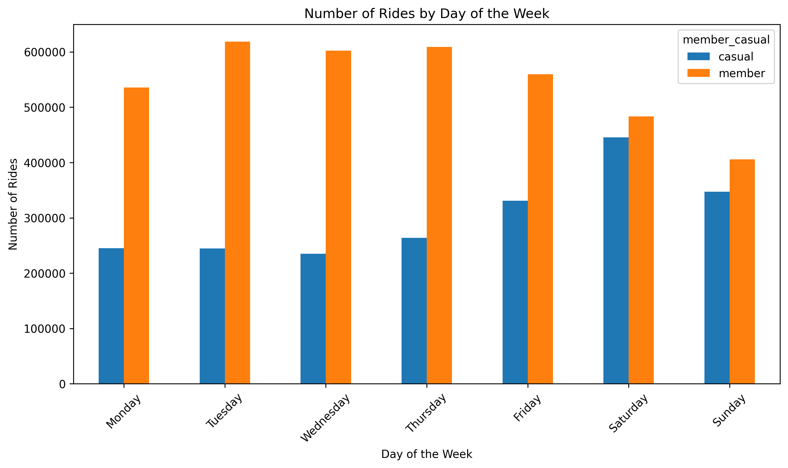
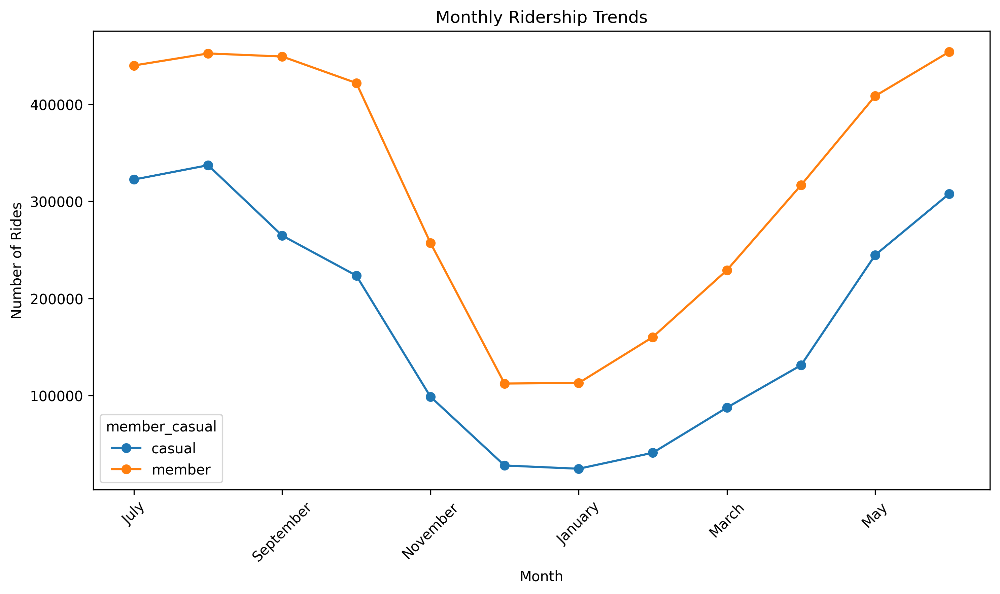

# Cyclistic Bike-Share Analysis
## Project Overview

This project analyses 12 months of Cyclistic bike-share data to understand how casual riders and annual members use the service differently. The analysis follows the Google data analysis process: Ask, Prepare, Process, Analyze, Share, and Act.

The goal is to provide data-driven recommendations that could help Cyclistic convert casual riders into annual members.
## Tools Used

- Python
- Pandas
- Matplotlib
- Google Colab
- Microsoft Word
- GitHub
## Key Findings

- Annual members accounted for 64.36% of all rides, while casual riders accounted for 35.64%.
- Casual riders took longer trips, averaging 18.57 minutes compared with 12.07 minutes for members.
- Member usage was strongest on weekdays, especially during morning and evening peak hours.
- Casual rider usage increased on weekends and during warmer months.
- Electric bikes were the most commonly used bike type for both groups.
## Recommendations

1. Target casual riders with weekend and seasonal membership promotions.
2. Promote annual membership benefits to frequent electric-bike users.
3. Use personalised digital marketing during peak casual-rider periods.
## Project Files

- [View the full case study report](./Cyclistic%20Bike-Share%20Case%20Study%20-%20Naa%20Adjeley%20Mensah-Quaye.pdf)
- [View the Python analysis notebook](./Cyclistic_Bike_Share_Analysis%20%281%29.ipynb)
## Data Source

The analysis uses publicly available Divvy trip data covering July 2025 to June 2026. Cyclistic is a fictional company used for the Google Data Analytics Capstone case study.

The original dataset was not uploaded to this repository because of its large size.
## Visual Preview

